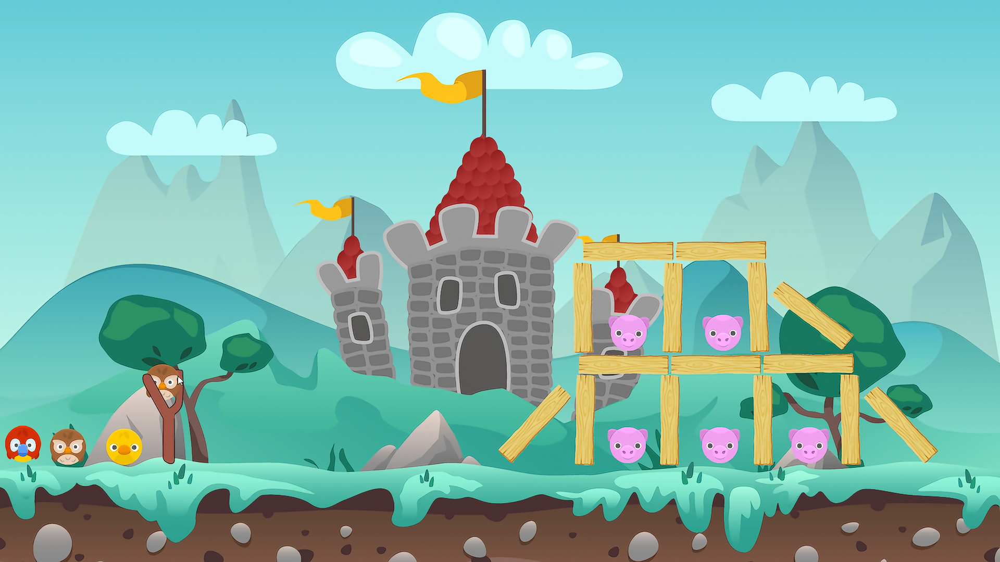

# Angry Birds Clone

## Features

1. Exploding Owl and Enemy
2. 2 Level
3. UI (Win and Lose Condition and Play Again)
4. Sound effect

### Built With

* [![Unity][Unity.com]][Unity-url]

[Unity.com]: https://img.shields.io/badge/Unity-FFFFFF?style=for-the-badge&logo=unity&logoColor=black
[Unity-url]: https://unity.com/

## Documentation

### Game Preview
     

### Demo

## Prerequisite

- Unity latest software build

## Installation
Clone this project and then import into Unity Hub.
Simply run the project
